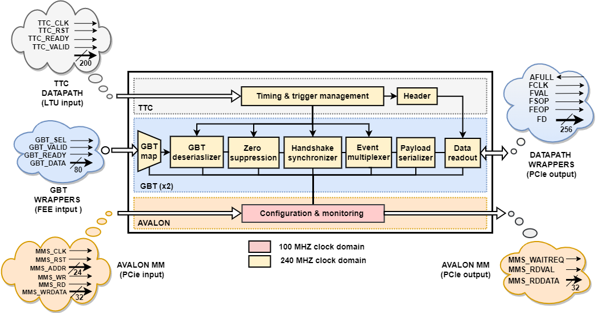

# Master of Engineering: Electrical Engineering.
===================

## Design and development of MID user-logic component 

#### Prerequisite 

The design is validated using **QUARTUS Prime 18.1 Pro** and **Intel-ModelSim**

### Design component 
___
The block diagram shows the user-logic component. 

Each module is connected to the avalon slave.
- The GBT wrappers transmit data through the GBT mapping. They are not symetrical as one side of the FPGA is fully used for GBT,
while the other one is used for PCIe and TTC fiber as well.
- Each datapath wrapper can manage up to 12 GBT links (FEE to CRU) and one user logic input. The data are transfered to one PCIe endpoint.
- Each user logic can take GBT inputs (FEE to CRU) process them and provide data to the datapath wrapper. It can also produces data and controls for the FEE. 
Therefore it can send data from CRU to FEE via the GBT. The GBT mux select the source for this data.
- The firmware is controlled through an avalon bus. 2 masters are possible : 
	- The PCIe0 endpoint
	- The PCIe1 endpoint
- The TTC interface receives and distributes the messages from the Central Trigger Processor (CTP) to the adequate sub-modules.
- The Single Word Transfer handler is used to transfer slow control command from the DCS to the FEE via the GBT.
- The Board Support can monitor temperatures, configure PLL, ...

## Authors

Orcel Thys